<div align="center">


# Nodyx

### *"The network is the people."*

**The self-hosted community platform you actually own.**  
Forum + Chat + Voice + P2P + Canvas + Homepage Builder + Streamer Hub, one server, one community, forever.

[](https://github.com/Pokled/nodyx/releases/latest)
[](https://www.gnu.org/licenses/agpl-3.0)
[](https://github.com/Pokled/Nodyx/actions/workflows/ci.yml)
[](docs/en/ARCHITECTURE.md)
[](https://ko-fi.com/Pokled)

<sub>⭐ If Nodyx resonates with you, a star helps others find it, and keeps us going.</sub>

</div>

<div align="center">

**[🌐 Discover → start.nodyx.org](https://start.nodyx.org)** &nbsp;·&nbsp;
**[📖 Documentation → nodyx.dev](https://nodyx.dev)** &nbsp;·&nbsp;
**[🚀 Live demo → nodyx.org](https://nodyx.org)** &nbsp;·&nbsp;
<a href="README.md"> English</a> · <a href="docs/fr/README.md"> Français</a>

</div>

<div align="center">

[✨ Features](#where-each-project-shines) &nbsp;|&nbsp;
[🧩 Homepage Builder](docs/en/HOMEPAGE-BUILDER.md) &nbsp;|&nbsp;
[🎥 Streamer Hub](docs/en/STREAMER-HUB.md) &nbsp;|&nbsp;
[🏗️ Architecture](#architecture) &nbsp;|&nbsp;
[📸 Screenshots](#screenshots) &nbsp;|&nbsp;
[🚀 Quick Start](#quick-start) &nbsp;|&nbsp;
[📋 Changelog](CHANGELOG.md) &nbsp;|&nbsp;
[🤝 Contributing](#contributing) &nbsp;|&nbsp;
[📚 Full docs](docs/en/)

</div>

---

> **Hey, before you scroll.** Nodyx isn't trying to fight Discord, and it isn't trying to be the only open alternative. There are great projects out there. Matrix, Stoat, Fluxer, Mattermost, Rocket.Chat, Discourse, Haven and others. And we genuinely want you to know about them. We list them, with their GitHub repos, on a page we wrote ourselves: **[→ Why Nodyx (and the other alternatives we respect)](https://nodyx.dev/why-nodyx)**.
>
> *The fight isn't between us. It's between locked silos and communities that actually own themselves. Pick the tool that fits you. We'll cheer either way.*

> **A tool that doesn't have to worry about the moods of a board of directors or the whims of an investor.**

<details>
<summary>🌍 Translations (click to expand)</summary>

| Language | Translation |
|----------|-------------|
| Français | Un outil qui n'a pas à craindre les humeurs d'un conseil d'administration ni les caprices d'un investisseur. |
| Deutsch | Ein Werkzeug, das sich nicht um die Launen eines Vorstands oder die Einfälle eines Investors kümmern muss. |
| Español | Una herramienta que no tiene que preocuparse por los humores de un consejo de administración ni por los caprichos de un inversor. |
| Italiano | Uno strumento che non deve preoccuparsi degli umori di un consiglio di amministrazione o dei capricci di un investitore. |
| Nederlands | Een tool die zich geen zorgen hoeft te maken over de stemmingen van een raad van bestuur of de grillen van een investeerder. |
| Português | Uma ferramenta que não precisa se preocupar com os humores de um conselho de administração ou com os caprichos de um investidor. |
| Polski | Narzędzie, które nie musi się martwić nastrojami zarządu ani kaprysami inwestora. |
| Русский | Инструмент, которому не нужно беспокоиться о настроениях совета директоров или капризах инвестора. |
| 中文 | 一个不必担心董事会情绪或投资者心血来潮的工具。 |
| 日本語 | 取締役会の気分や投資家の気まぐれを気にする必要のないツール。 |

</details>

<div align="center">
  
</div>

---

## Why Nodyx

- **Most communities don't own where they live.** Years of history, knowledge, and memories sit on platforms that can change rules, ban accounts, or disappear. That's not malice, that's how closed systems work by default.
- **Self-hosting today is fragmented.** Forum, real-time chat, voice, and a public homepage usually mean stitching five separate tools together.
- **Nodyx ships them in one install** so a community can fully own its presence, text, voice, and homepage, on hardware its admins control.

One command. Your server. Forever.

### Built on

| Layer | Technology |
|---|---|
| Backend API | **TypeScript** + **Fastify v5** + Socket.IO, `nodyx-core/` |
| Frontend | **SvelteKit 5** + Tailwind v4 + TipTap editor, `nodyx-frontend/` |
| Database | **PostgreSQL 16** (FTS, migrations) + **Redis 7** (sessions, presence) <sup>[¹](docs/en/ARCHITECTURE.md#why-postgresql-16-and-not-17-or-18)</sup> |
| Voice relay | **nodyx-turn**, Rust STUN/TURN (replaces coturn, 2.9 MB binary) |
| P2P tunneling | **nodyx-relay**, Rust TCP tunnel (home server, no open ports) |
| Real-time | WebRTC P2P mesh + Socket.IO fallback |
| Auth (optional) | **Nodyx Signet**, ECDSA P-256 passwordless PWA, `nodyx-authenticator/` |
| Process manager | **PM2** under a dedicated `nodyx` system user |
| Reverse proxy | **Caddy**, automatic Let's Encrypt TLS |

> **No Docker required.** The installer deploys Node.js + PostgreSQL + Redis + Caddy + PM2 natively. `docker-compose.yml` is provided for local development only.

---

## The internet broke something.

Closed platforms ended up holding more conversations than the open web ever did. Not by malice, by default. They were free, easy, and everyone was already there.

But ten years of discussions, tutorials, and collective knowledge now sit behind login walls. Invisible to search engines. Bound to terms of service written in a Delaware courtroom. Gone when the platform decides.

**You never owned any of it.**

---

## Nodyx gives it back.

One command. Your server. Your rules. Your community, permanently.

```bash
curl -fsSL https://nodyx.org/install.sh | bash
```

Works on a Raspberry Pi behind a home router. No domain. No open ports. No cloud account.

---

## Where each project shines

The community-tools landscape isn't a battle. Each project optimizes for different things, and the right pick depends on what you're building. Here's how we'd recommend it to a friend:

| Project | What it does best | Where it fits |
|---|---|---|
| **Discord** | Real-time voice + chat for closed groups, mobile-first, 10+ years of bot ecosystem | If your community is private and ad-hoc |
| **Matrix** ([Element](https://github.com/element-hq/element-web)) | Federated protocol with bridges to almost everything (Discord, Slack, Telegram, IRC, ...) | If interoperability is non-negotiable |
| **[Discourse](https://github.com/discourse/discourse)** | Indexed, searchable forums and knowledge bases | If long-form async discussion is your core |
| **[Mattermost](https://github.com/mattermost/mattermost)** / **[Rocket.Chat](https://github.com/RocketChat/Rocket.Chat)** | Enterprise compliance, Slack-replacement at scale | If you have a procurement team |
| **[Haven](https://github.com/ancsemi/Haven)** | Privacy-first chat, zero cloud, native Windows/Linux/Android clients, no telemetry | If keeping every byte on your own machine matters most |
| **[Stoat](https://github.com/stoatchat/self-hosted)** (ex-Revolt) / **[Fluxer](https://github.com/fluxerapp/fluxer)** | Discord-shaped UI, easy migration | If your members already know Discord |
| **Lemmy** | Federated, Reddit-style threaded forums | If you want a fediverse-native presence |
| **Nodyx** | Forum + chat + voice + canvas + homepage builder, in one self-hosted install with a P2P relay for home servers | If you want to fully own a multi-format community on your own hardware |

> Nodyx is **the only project** combining all of those formats in a single install, but if you only need one or two, another tool above may fit you better.
>
> [Read our honest take, including the alternatives we respect →](https://nodyx.dev/why-nodyx)

### What's inside the Nodyx single install

- Indexed forum (canonical URLs, JSON-LD, sitemap, Google-friendly)
- Real-time chat with replies, pins, reactions, unfurls
- P2P voice channels, zero Big Tech relay
- Collaborative P2P canvas (whiteboard)
- WebRTC DataChannels for instant typing/reactions
- Home server support, no port forwarding, no domain required
- Federated community directory + cross-instance global search
- Asset library (frames, badges, banners, profile themes)
- Ephemeral whisper rooms
- Passwordless login (ECDSA P-256 PWA, Nodyx Signet)
- Collaborative jukebox (YouTube queue)
- Event calendar (OSM maps, RSVP, SEO)
- **Homepage Builder** with 11 layout zones, drag & drop
- **Widget Store**, install external widgets via .zip
- **Widget SDK**, build custom widgets, no framework needed
- **OctoGuard**, native auto-mod (regex/word/link/emoji-flood, ReDoS-safe via Google `re2`), welcome bot, custom commands, mutes, signed webhook, all admin-tunable, off by default
- **Streamer Hub**, Twitch integration with a native Soundboard (ID3 tags, viewer queue, `!ns` chat command), a multi-page mobile Stream Deck, OBS browser-source overlays (alerts, goals, timers, tickers, leaderboards, clips, soundboard) and audio playlists with per-playlist OBS scenes
- **Rich article editor**, anchor-on-selection table of contents, corner-handle image resize, protected code/render blocks, two-column layouts, embedded media, all round-trip safe through the sanitizer

---

## Homepage Builder + Widget SDK

Nodyx ships with a **drag-and-drop Homepage Builder** (11 layout zones, 4 native widgets, per-widget audience and scheduling) and a complete **Widget SDK**, plain JavaScript Custom Elements, no React, no Vue, no npm required. Any developer can package a widget as a `.zip` and install it on any Nodyx instance in one click, no rebuild, no deploy. Two features that no other self-hosted community platform offers together.

→ **[Homepage Builder, full guide](docs/en/HOMEPAGE-BUILDER.md)**, layout zones, native widgets, the Widget Store
→ **[Build your first widget](https://nodyx.dev/create-widget)**, step-by-step SDK guide for non-developers

---

## Streamer Hub, your whole live stream from Nodyx

Nodyx ships a complete **Streamer Hub**: a native Soundboard (drag-and-drop upload, automatic ID3 tags, Redis-backed viewer queue, `!ns` Twitch chat command with fuzzy matching), a mobile multi-page Stream Deck, seven OBS browser-source overlay types (alert, goal, timer, ticker, leaderboard, clips, soundboard) with an OBS-style Scenes composer, and two-way Twitch chat integration. Start OBS, then barely touch it again. No wiring three SaaS together, no monthly bots, your community owns the whole setup.

→ **[Streamer Hub, full guide](docs/en/STREAMER-HUB.md)**, setup, Twitch connection, every feature in depth

---

## The P2P Stack, 100% handwritten Rust

This is where Nodyx goes further than anyone else. **nodyx-turn** is a 2.9MB Rust STUN/TURN server that replaces coturn (RFC 5389 + 5766 + 6062, zero coturn dependency in production). **nodyx-relay** is a Rust P2P TCP tunnel that runs Nodyx behind a home router with no domain, no port forwarding, no cloud account, validated on a real Raspberry Pi 4 with zero open ports. On top of both, WebRTC DataChannels move typing indicators and emoji reactions peer-to-peer at under 5ms, with automatic Socket.IO fallback under strict NAT.

→ **[Relay & P2P, full guide](docs/en/RELAY.md)**, how it works, installation, troubleshooting, technical architecture

### NodyxCanvas, Collaborative whiteboard (v2.2)

<div align="center">
  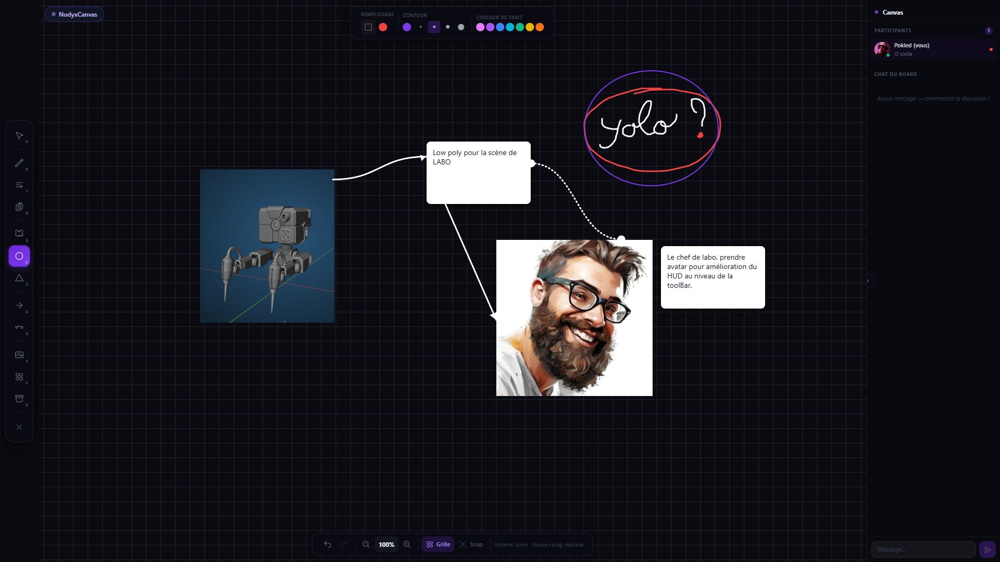
</div>

Draw, annotate, and build together in real time, directly inside voice channels.
Synced via Socket.IO CRDT. Every op is persistent (PostgreSQL JSONB snapshot).

```
CRDT Last-Write-Wins per element (UUID + timestamp)
canvas:op / canvas:clear / canvas:cursor / canvas:chat  →  Socket.IO
Voice-aware cursors: peer cursor pulses when they're speaking
Real-time participants panel with live tool + avatar
Board-scoped chat (independent from the voice channel chat)
```

**Tools (v2.2):**

| Tool | Key | Description |
|---|---|---|
| Select | V | Move + resize with 8 handles (corners + midpoints) |
| Pen | P | Freehand drawing, color, width, opacity |
| Text | T | Rich inline text, bold/italic/underline/strike, align, font, size |
| Sticky | N | Post-it note, 8 colors, multiline |
| Rect / Circle | R / C | Fill + stroke with independent colors and width |
| Shape | S | Advanced shapes, triangle, diamond, star, hexagon, cloud |
| Arrow | A | Styled arrows, solid/dashed/dotted, 3 cap types |
| Connector | X | Smart connectors, straight/bezier/elbow, independent start+end caps |
| Image | I | Drag & drop or file picker → uploaded to `/assets`, rendered on canvas |
| Frame | F | Named section, label + dashed border, groups elements visually |
| Eraser | E | Point eraser |

**Canvas features:**
- Undo / Redo, 50-op stack per session, Ctrl+Z / Ctrl+Y / Ctrl+Shift+Z
- Snap to grid, 28px world grid, toggleable (G)
- Zoom, Ctrl+Scroll, pinch, or toolbar buttons (5% → 1000%)
- Pan, Space+drag or middle-click drag
- Minibar bottom, zoom %, grid toggle, snap toggle
- Export PNG, downloads full canvas, posts recap to chat channel

---

## Screenshots

<div align="center"><sub>Community · Builder · Admin · Features, all running on a single install</sub></div>

<br/>

<div align="center"><b>,  Community Experience , </b></div>

<table>
  <tr>
    <td align="center"><b>Homepage, Grid Builder</b></td>
    <td align="center"><b>Forum</b></td>
  </tr>
  <tr>
    <td>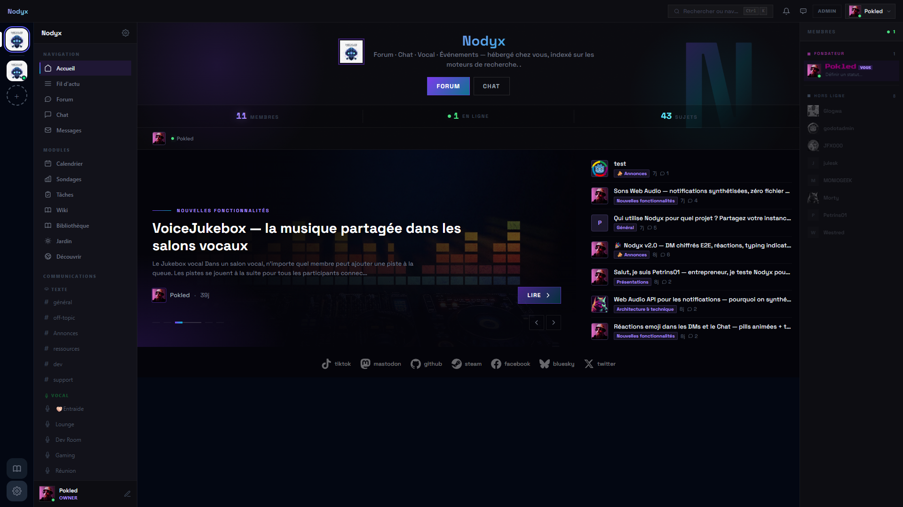</td>
    <td>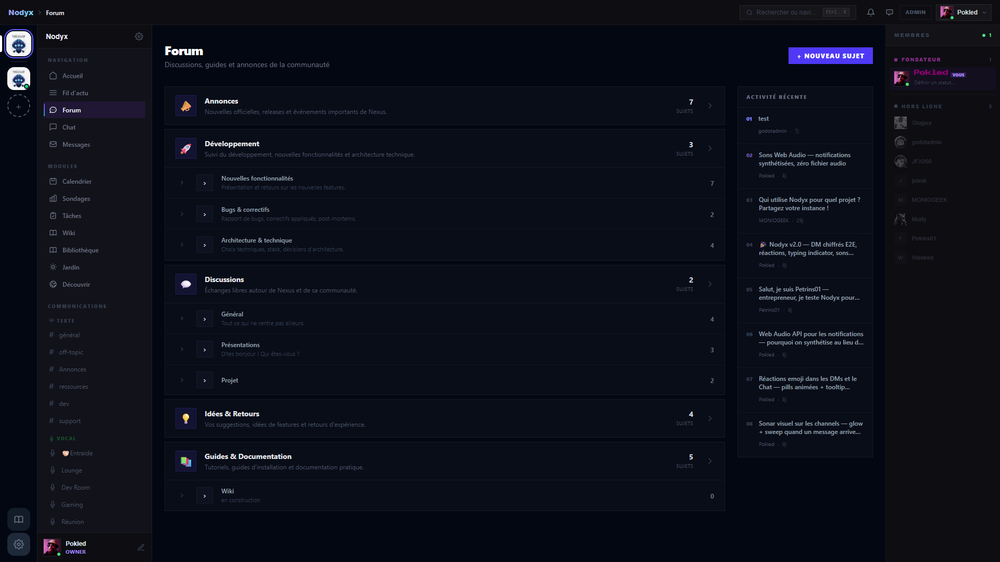</td>
  </tr>
  <tr>
    <td align="center"><b>Real-time Chat</b></td>
    <td align="center"><b>Voice Channels, P2P WebRTC</b></td>
  </tr>
  <tr>
    <td>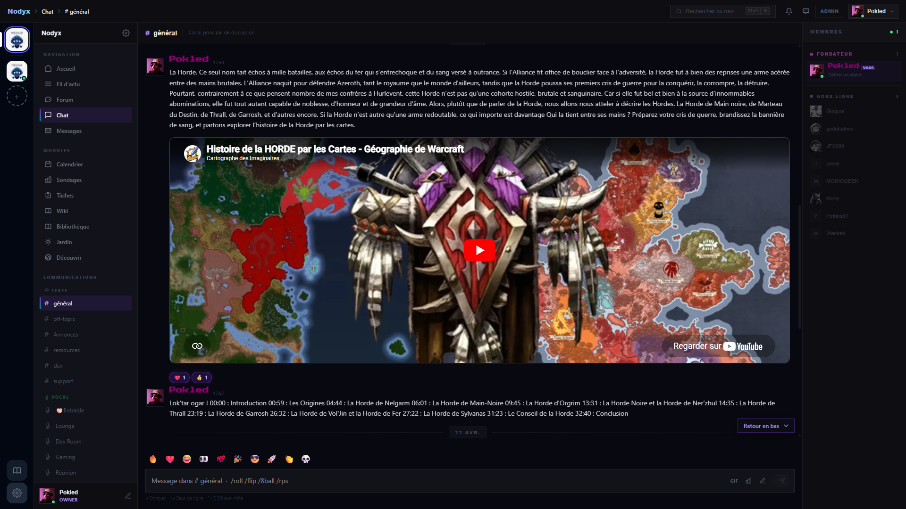</td>
    <td>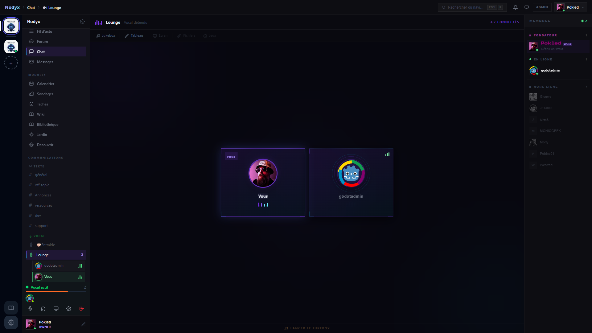</td>
  </tr>
</table>

<br/>

<div align="center">

<b>,  Homepage Builder , </b>

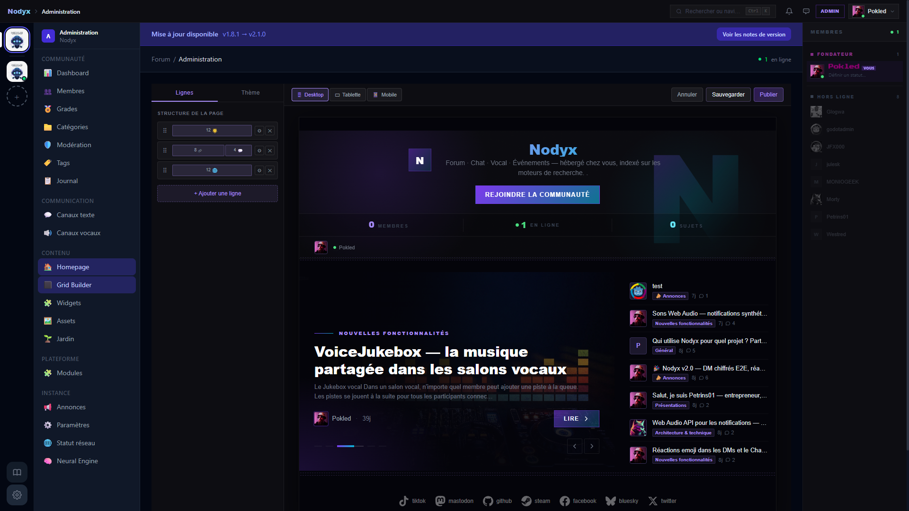

<sub>Drag-and-drop grid editor, 11 layout zones, live preview, per-widget audience rules and scheduling</sub>

</div>

<br/>

<table>
  <tr>
    <td align="center"><b>Widget Store, install via .zip</b></td>
    <td align="center"><b>Module Management</b></td>
  </tr>
  <tr>
    <td>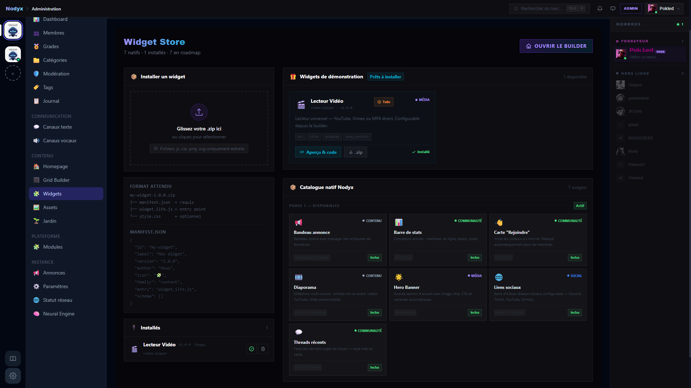</td>
    <td>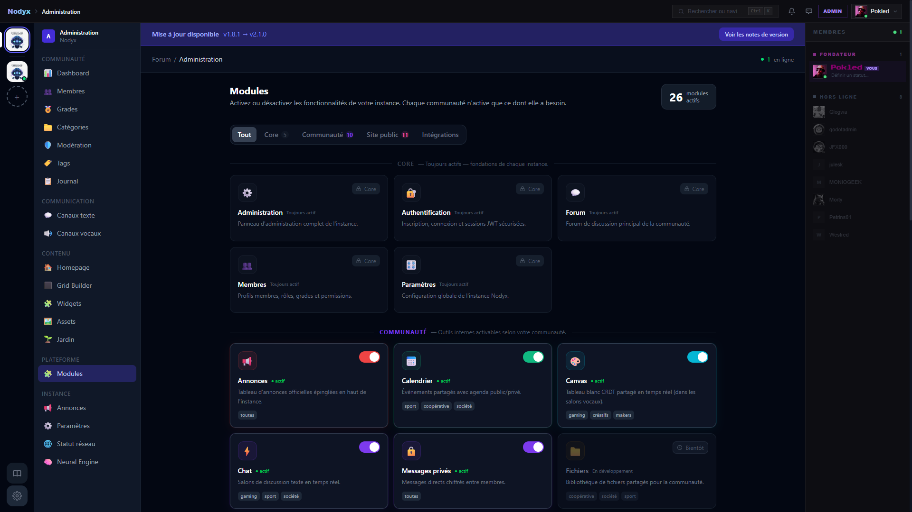</td>
  </tr>
</table>

<br/>

<div align="center"><b>,  Features , </b></div>

<table>
  <tr>
    <td align="center"><b>Cross-Instance Search</b></td>
    <td align="center"><b>Polls, Forum & Chat</b></td>
  </tr>
  <tr>
    <td>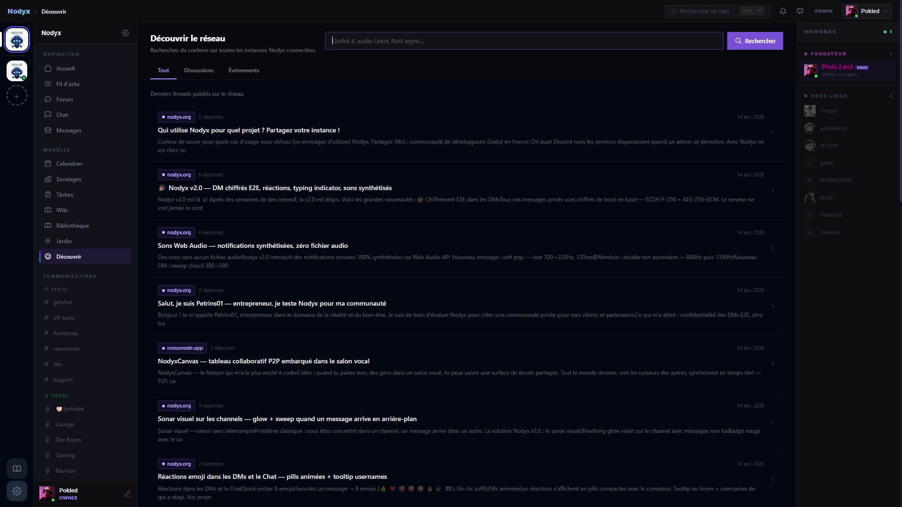</td>
    <td>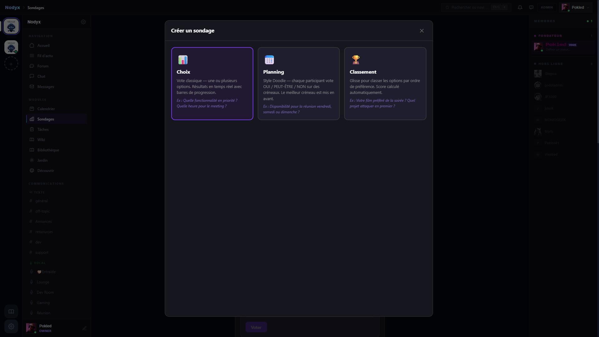</td>
  </tr>
  <tr>
    <td align="center"><b>Wiki</b></td>
    <td align="center"><b>Asset Library</b></td>
  </tr>
  <tr>
    <td>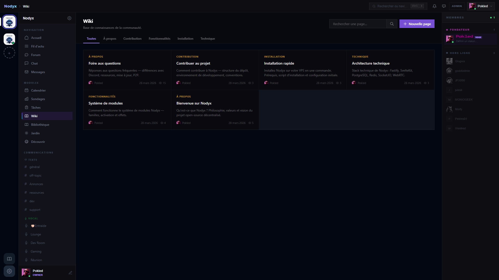</td>
    <td>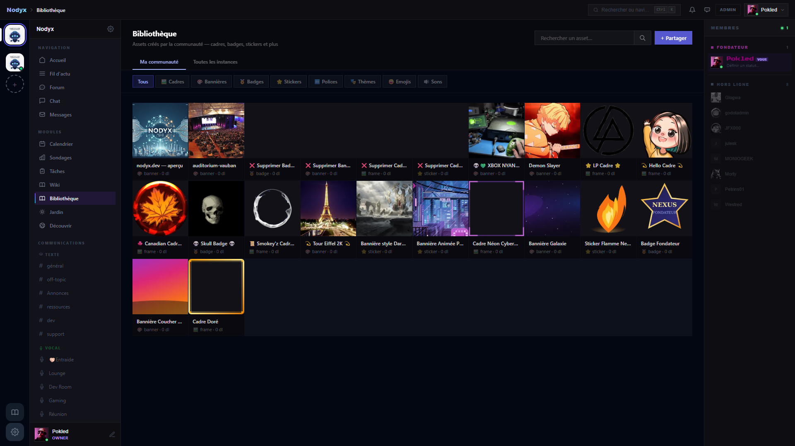</td>
  </tr>
</table>

---

## Quick Start

### Prerequisites

The installer handles everything automatically. Your system only needs **`curl`** and **`git`** to get started.

```bash
# Ubuntu / Debian
apt-get install -y git curl
```

**PM2 memory limits are automatically tuned to your machine:**

| Total RAM | nodyx-core | nodyx-frontend | Auto-swap | Works on |
|---|---|---|---|---|
| < 1.5 GB | 256 MB | 192 MB | 2 GB created | Raspberry Pi 1 GB |
| 1.5 - 3 GB | 384 MB | 256 MB | 1 GB if needed | RPi 4 / small VPS |
| ≥ 3 GB | 512 MB | 512 MB | 1 GB if needed | Standard VPS ⭐ |

> Raspberry Pi: use a **64-bit OS** (Raspberry Pi OS 64-bit or Ubuntu ARM64). 32-bit is not supported.

### One-click install

```bash
curl -fsSL https://nodyx.org/install.sh | bash
```

Or clone first:

```bash
git clone https://github.com/Pokled/Nodyx.git && cd Nodyx && sudo bash install.sh
```

The installer offers **three network modes**:

| Mode | Requirements | Result |
|---|---|---|
| **Nodyx Relay** ⭐ | Nothing, outbound TCP only | `yourclub.nodyx.org` in minutes |
| **Open ports** | Ports 80 + 443, domain or IP | Let's Encrypt HTTPS, full control |
| **Cloudflare Tunnel** | CF account + own domain | Your custom domain, no open ports |

> **Nodyx Relay** is the recommended default, works on a Raspberry Pi behind a home router.
> No domain. No port forwarding. No cloud account. Just run the script.

Installs automatically: **Node.js 20, PostgreSQL 16, Redis 7, Caddy (HTTPS), PM2, nodyx-turn** (Rust STUN/TURN).  
Generates secrets, runs all DB migrations, creates your admin account. **No Docker. No manual configuration.**

> Supported: Ubuntu 22.04 / 24.04, Debian 11 / 12 / 13.

→ **[Complete installation guide (EN)](docs/en/INSTALL.md)**  
→ **[Guide d'installation complet (FR)](docs/fr/INSTALL.md)**

### Updating an existing instance

```bash
cd /var/www/nexus && git pull && \
  cd nodyx-core && npm run build && sudo -u nodyx pm2 restart nodyx-core && \
  cd ../nodyx-frontend && npm run build && sudo -u nodyx pm2 restart nodyx-frontend
```

Database migrations are applied automatically on startup, no manual SQL needed.

---

## Architecture

### Repository layout

```
nodyx/
├── nodyx-core/          → Fastify v5 + TypeScript REST API, Socket.IO, DB migrations
├── nodyx-frontend/      → SvelteKit 5 + Tailwind v4 SPA (SSR + client hydration)
├── nodyx-p2p/           → Rust workspace: nodyx-relay (TCP tunnel) + nexus-turn (STUN/TURN)
├── nodyx-authenticator/ → Nodyx Signet, ECDSA P-256 passwordless auth PWA (SvelteKit 5)
├── nodyx-hub/           → Olympus Hub, internal admin dashboard (SvelteKit 5)
├── nodyx-docs/          → nodyx.dev documentation site (SvelteKit 5)
├── docs/                → Markdown docs (EN + FR), served by nodyx-docs
├── install.sh           → One-click installer (Node + PG + Redis + Caddy + PM2, no Docker)
├── ecosystem.config.js  → PM2 process config (production)
└── docker-compose.yml   → Local development only, not used in production installs
```

### Federation, how it works

Each Nodyx instance runs a **Gossip Protocol** scheduler that periodically pings the central directory (`nodyx.org/api/directory`). Instances share their public metadata (name, slug, URL, member count) and are discoverable via the `/discover` page on any instance. Events (calendar) federate across instances through the same gossip mechanism. There is no dependency on ActivityPub, the protocol is intentionally minimal and self-contained.

### Runtime diagram

```
┌─────────────────────────────────────────────────────────────┐
│                        Your Browser                         │
└──────────────┬──────────────────────────────┬───────────────┘
               │ HTTP / WebSocket             │ WebRTC P2P
               ▼                             ▼
┌──────────────────────────┐    ┌────────────────────────────┐
│   nodyx-core (Fastify)   │    │  Direct peer connection    │
│   nodyx-frontend (Svelte)│    │  DataChannels + Canvas     │
│   PostgreSQL + Redis     │    │  Voice + Screen share      │
└──────────────────────────┘    └────────────────────────────┘
               │                             │
        ┌──────┴──────┐               ┌──────┴──────┐
        │ nodyx-relay │               │ nodyx-turn  │
        │ (Rust TCP)  │               │ (Rust TURN) │
        │ home server │               │ NAT bypass  │
        └─────────────┘               └─────────────┘
```

| Layer | Technology |
|---|---|
| API | TypeScript + Fastify v5, `nodyx-core/` |
| Database | PostgreSQL 16 · 53 migrations, automatic on startup |
| Cache / Sessions | Redis 7, JWT sessions, presence, rate-limiting |
| Full-text search | PostgreSQL FTS (tsvector + GIN), cross-instance via Gossip |
| Frontend | SvelteKit 5 + Tailwind v4, `nodyx-frontend/` |
| Editor | TipTap (WYSIWYG) |
| Real-time | Socket.IO (polling-first, WebSocket upgrade) |
| Voice | WebRTC P2P mesh, no central audio relay |
| TURN relay | **nodyx-turn**, Rust 2.9 MB, replaces coturn |
| P2P relay | **nodyx-relay**, Rust TCP tunnel, runs on home servers |
| Collaborative canvas | **NodyxCanvas**, CRDT LWW, Socket.IO sync, 11 tools, resize handles, undo/redo |
| Homepage | **Homepage Builder**, 11 zones, drag & drop, visibility rules |
| Widgets | **Widget Store**, .zip install + **Widget SDK** (Web Components) |
| Passwordless auth | **Nodyx Signet**, ECDSA P-256 PWA, `nodyx-authenticator/` |

---

## What's built. What's coming.

Nodyx has shipped 12 major releases since February 2026: the forum, chat and voice foundation, a full paranoid security audit (Argon2id, honeypots, fail2ban, 2FA), private E2E-encrypted DMs, a Homepage Builder with a Widget SDK, a native Streamer Hub, a verified backup system with one-click restore, OctoGuard native auto-moderation, and now an experimental Rust SFU carrying voice and screen sharing through your own server.

→ **[Full changelog, every version in detail](CHANGELOG.md)**
→ **[Roadmap, where we're going](docs/en/ROADMAP.md)**

---

## The Vision

Nodyx is not a Discord alternative.

It is a different answer to a different question.

Discord asked: *"How do we grow fast and capture communities?"*  
Nodyx asks: *"How do we give communities sovereignty over their own existence?"*

Every Nodyx instance is a sovereign node. It runs where you run it, a VPS, a Pi, a spare laptop. It stores what you choose to store. It shares what you choose to share. It shuts down when you decide, not when a company pivots.

The internet was decentralized by design. SMTP, IRC, NNTP, anyone could run a server and talk to anyone else's server. That was the promise. Big Tech centralized it into silos over two decades.

**Nodyx is the promise, kept.**

And it spreads the same way. Each instance that goes live exposes others to the idea. Each public event indexed by Google brings in someone new. Each community that chooses sovereignty inspires another.

> *"Fork us if we betray you."*, AGPL-3.0

---

## Documentation

| Language | Docs |
|---|---|
|  English | [nodyx.dev](https://nodyx.dev) · [docs/en/](docs/en/) |
|  Français | [docs/fr/](docs/fr/) |
|  Español | *coming soon* |
|  Deutsch | *coming soon* |

- [**nodyx.dev**](https://nodyx.dev), Full documentation wiki
- [**Create a Widget**](https://nodyx.dev/create-widget), Step-by-step Widget SDK guide
- [Manifesto](docs/en/MANIFESTO.md), Why Nodyx exists
- [Architecture](docs/en/ARCHITECTURE.md), How it's built
- [Roadmap](docs/en/ROADMAP.md), Where we're going
- [Audio Engine](docs/en/AUDIO.md), Broadcast EQ, RNNoise, full audio chain
- [Neural Engine](docs/en/NEURAL-ENGINE.md), Local AI with Ollama
- [**NODYX-ETHER**](docs/ideas/NODYX-ETHER.md), The physical layer vision (LoRa / HF radio / ionosphere)

---

## Contributing

Nodyx belongs to its community.

1. Browse [open Issues](https://github.com/Pokled/Nodyx/issues) or open a [Discussion](https://github.com/Pokled/Nodyx/discussions)
2. Read [CONTRIBUTING.md](docs/en/CONTRIBUTING.md) before opening a PR
3. Commits follow [Conventional Commits](https://www.conventionalcommits.org/), written in English

Contribute freely, no prior validation required:

```
docs/        →  improve or translate documentation
docs/ideas/  →  design thinking, UX proposals, new ideas
```

The core (`nodyx-core/src/`) requires discussion first, open an Issue.

### 🌍 Translate Nodyx

Nodyx speaks 7 languages. French and English are complete, and the core interface is translated in all of them. The rest is open.

**👉 [nodyx.org/translate](https://nodyx.org/translate)** shows the exact state of every language and links straight to the file you would edit.

No account to create, no tool to install, no platform in the middle. Each language is one flat JSON file in `nodyx-frontend/src/lib/locales/`. Pick your language, fill in the missing keys, leave every `{{variable}}` alone, open a Pull Request. CI checks the placeholders, so translating cannot break the app.

Two people already brought a whole language in this way, and both are in the Nodyx Stars below.

---

## 🌟 Nodyx Stars, Contributors

Every external contribution earns a star. Every Star goes on [our Hall of Fame](CONTRIBUTORS.md), with avatar, profile link, and rank. **Recognition is not optional here.** Open source without recognition is just free labor, and that's not how we roll.

<table>
  <tr>
    <td align="center" width="140">
      <a href="https://github.com/Pranto2003"></a><br/>
      <b>Pranto Goswamee</b><br/><sub>🌟 First contributor</sub>
    </td>
    <td align="center" width="140">
      <a href="https://github.com/waazaa-fr"></a><br/>
      <b>waazaa-fr</b><br/><sub>🌟🌟 Installer bugs</sub>
    </td>
    <td align="center" width="140">
      <a href="https://github.com/naranco66"></a><br/>
      <b>naranco66</b><br/><sub>🌟🌟🌟 Spanish (es-ES)</sub>
    </td>
    <td align="center" width="140">
      <a href="https://github.com/forke24x7"></a><br/>
      <b>forke24x7</b><br/><sub>🌟🌟🌟🌟🌟 German (de)</sub>
    </td>
    <td align="center" width="140">
      <a href="https://github.com/lukasMega"></a><br/>
      <b>Lukáš Melega</b><br/><sub>🌟🌟 Docs search</sub>
    </td>
  </tr>
</table>

👉 **[Read every story and see all contributors →](CONTRIBUTORS.md)**

---

## Support Nodyx

Nodyx is built by one developer, with no VC money and no strings attached. If the project is useful to you, consider supporting it:

<a href="https://ko-fi.com/Pokled"></a>

Your support helps cover server costs and keeps Nodyx 100% free and open-source.

---

## License

**AGPL-3.0**, The strongest open source license for networked software.

If you use Nodyx, even over a network, your modifications must be open source.
If Nodyx ever betrays its principles, this license lets anyone fork it and continue in the spirit of the [Manifesto](docs/en/MANIFESTO.md).

---

<div align="center">
  <p><em>Born February 18, 2026.</em></p>
  <p><strong>"Fork us if we betray you."</strong></p>
</div>
